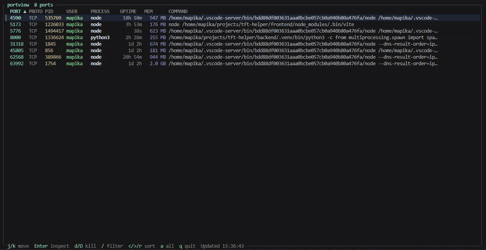

# portview

[](https://github.com/mapika/portview/actions/workflows/ci.yml)
[](https://crates.io/crates/portview)
[](LICENSE)

**See what's on your ports, then act on it.**

`lsof -i` is slow and cryptic. `ss -tlnp` is unreadable. `netstat` is deprecated. You just want to know what's on port 3000 and kill it.

```bash
portview
```

One command. Every listening port, the process behind it, memory usage, uptime, and the full command — in a colored table. Then inspect, kill, or watch it live.

<p align="center">
  
</p>

~1 MB single binary. Zero runtime dependencies. Linux, macOS, and Windows.

## Install

```bash
curl -fsSL https://raw.githubusercontent.com/mapika/portview/main/install.sh | sh   # Linux/macOS
irm https://raw.githubusercontent.com/mapika/portview/main/install.ps1 | iex         # Windows
brew install mapika/tap/portview                                                      # Homebrew
cargo install portview                                                                # Cargo
```

Or grab a binary from [Releases](https://github.com/mapika/portview/releases).

## What it does

```bash
portview                          # list all listening ports
portview 3000                     # inspect port 3000 in detail
portview node                     # find ports by process name
portview watch                    # interactive TUI with live refresh
portview watch --docker           # TUI with Docker containers as rows
portview kill 3000 --force        # kill what's on port 3000
portview doctor                   # diagnose port conflicts and issues
portview ssh user@server          # inspect ports on a remote host
portview ssh user@server watch    # remote TUI over SSH
```

## Features

### Scan

```
$ portview
╭──────┬───────┬───────┬──────┬──────────┬─────────┬────────┬─────────────────────────────────────╮
│ PORT │ PROTO │ PID   │ USER │ PROCESS  │ UPTIME  │ MEM    │ COMMAND                             │
├──────┼───────┼───────┼──────┼──────────┼─────────┼────────┼─────────────────────────────────────┤
│ 3000 │ TCP   │ 48291 │ mark │ node     │ 3h 12m  │ 248 MB │ next dev                            │
│ 5432 │ TCP   │ 1203  │ pg   │ postgres │ 14d 2h  │ 38 MB  │ /usr/lib/postgresql/16/bin/postgres │
│ 6379 │ TCP   │ 1198  │ redis│ redis    │ 14d 2h  │ 12 MB  │ redis-server *:6379                 │
│ 8080 │ TCP   │ 51002 │ mark │ python3  │ 22m     │ 45 MB  │ uvicorn main:app --port 8080        │
╰──────┴───────┴───────┴──────┴──────────┴─────────┴────────┴─────────────────────────────────────╯
```

`--all` includes non-listening connections. `--wide` shows full commands. `--json` for scripting.

### Watch mode (interactive TUI)

```bash
portview watch                    # live-refresh every 1s
portview watch --docker           # Docker containers as first-class rows
portview watch --sort mem         # sort by memory on launch
```

| Key | Action |
|-----|--------|
| `j`/`k`, `↑`/`↓` | Navigate rows |
| `Enter` | Inspect port (full command, cwd, children, connections) |
| `d`/`D` | Kill process or manage Docker container |
| `/` | Filter across all columns |
| `←`/`→`, `r` | Cycle sort column, reverse direction |
| `t` | Toggle process tree view |
| `a` | Toggle all/listening-only |
| `q` | Quit |

**Tree view** (`t`): Groups child processes under their parents with visual connectors. See which workers belong to which master process at a glance.

**Detail view** (`Enter`): Shows the full unwrapped command, working directory, child process list with ports, and open connections (in `--all` mode).

### Doctor

Diagnose common port problems in one command:

```
$ portview doctor
  ✓ No port conflicts
  ✗ postgres (PID 1203) is listening on 0.0.0.0:5432 — consider binding to 127.0.0.1
  ✓ No Docker-host conflicts
  ✓ No stale connections
  ✓ No high-resource listeners

  1 warning found
```

Checks for: port conflicts (multiple PIDs on same port), wildcard exposure (databases on 0.0.0.0), Docker-host conflicts, stale TIME_WAIT/CLOSE_WAIT pileups, and high-memory listeners. Docker is auto-detected.

`portview doctor --json` for CI integration (exit code 1 on errors).

### SSH remote mode

Inspect ports on any machine you can SSH to:

```bash
portview ssh user@server              # one-shot scan
portview ssh user@server watch        # full interactive TUI
portview ssh user@server doctor       # remote diagnostics
portview ssh user@server 3000         # inspect a remote port
portview ssh user@server --ssh-opt "-p 2222"  # custom SSH port
```

Requires portview installed on the remote host. Kill actions in the remote TUI are forwarded over SSH.

### Docker integration

Add `--docker` to any command. Docker-published ports appear as first-class rows:

```
$ portview --docker
╭──────┬───────┬───────┬────────┬──────────┬────────┬────────┬───────────────────────────────────╮
│ PORT │ PROTO │ PID   │ USER   │ PROCESS  │ UPTIME │ MEM    │ COMMAND                           │
├──────┼───────┼───────┼────────┼──────────┼────────┼────────┼───────────────────────────────────┤
│ 3000 │ TCP   │ 48291 │ mark   │ node     │ 3h 12m │ 248 MB │ next dev [docker:web]             │
│ 8080 │ TCP   │ -     │ docker │ pv-nginx │      - │      - │ nginx:alpine :8080->80/tcp        │
╰──────┴───────┴───────┴────────┴──────────┴────────┴────────┴───────────────────────────────────╯
```

Press `d` on a Docker row to **Stop**, **Restart**, or **tail Logs**.

### JSON output

```bash
portview --json                   # pipe to jq, scripts, dashboards
portview --docker --json          # includes Docker ownership data
portview watch --json             # streaming JSON, one array per tick
portview doctor --json            # machine-readable diagnostics
```

### Custom colors

```bash
PORTVIEW_COLORS="port=red,pid=magenta,command=bright_cyan" portview
```

Columns: `port`, `proto`, `pid`, `user`, `process`, `uptime`, `mem`, `command`. Use `--no-color` to disable.

## How it works

All data is read directly from the OS — no shelling out to `lsof`, `ss`, or `netstat`.

| Field | Linux | macOS | Windows |
|-------|-------|-------|---------|
| Ports | `/proc/net/tcp{,6}`, `udp{,6}` | `proc_pidfdinfo` | `GetExtendedTcp/UdpTable` |
| PID | inode→pid via `/proc/*/fd/` | `proc_listpids` | Included in socket table |
| Process | `/proc/<pid>/comm` | `proc_pidpath` | `QueryFullProcessImageNameW` |
| Memory | `/proc/<pid>/status` VmRSS | `proc_pidinfo` | `K32GetProcessMemoryInfo` |
| Uptime | `/proc/<pid>/stat` | `proc_pidinfo` | `GetProcessTimes` |

Docker integration queries `docker ps` when `--docker` is passed. SSH mode runs `portview --json` on the remote host via the system `ssh` binary.

## Why not...

| Tool | What's missing |
|------|---------------|
| `lsof -i :3000` | Different flags per OS, cryptic output, slow |
| `ss -tlnp` | Unreadable, no uptime/memory/docker, no TUI |
| `netstat` | Deprecated on modern Linux, limited info |
| `fkill-cli` | Requires Node.js, kill-first not diagnostic-first |
| `procs` | General process viewer, not port-centric |

portview is **diagnostic-first**: understand what's on your ports, then act.

## Building from source

```bash
git clone https://github.com/mapika/portview
cd portview
cargo build --release
```

Requires Rust 1.85+ (edition 2024). Shell completions and man page are generated at build time.

## Contributing

See [CONTRIBUTING.md](CONTRIBUTING.md) for development setup and guidelines.

## Limitations

- **Linux:** Other users' processes require `sudo` (needs `/proc/<pid>/fd/` access)
- **macOS:** Other users' processes may require `sudo`
- **Windows:** Some system processes not accessible. Kill always force-terminates. Run as Administrator for full visibility.
- **Docker:** Requires `docker` CLI and daemon access
- **SSH:** Requires portview installed on the remote host

## License

MIT
