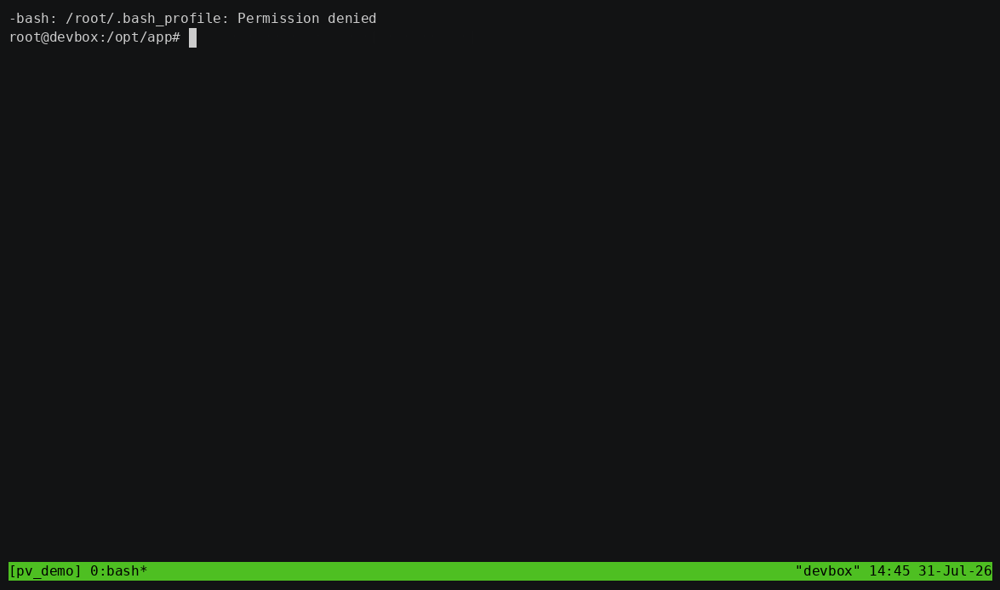
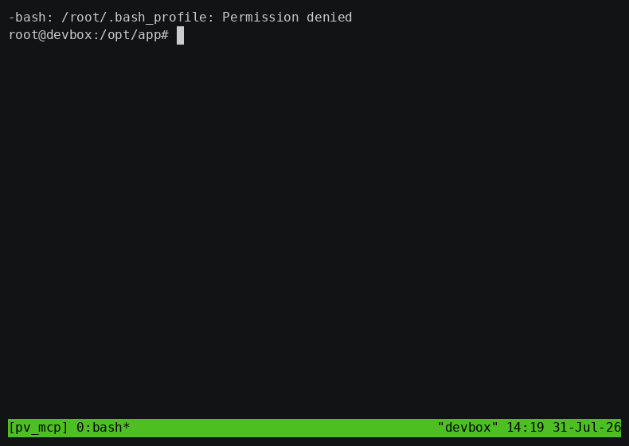

# portview

[](https://github.com/mapika/portview/actions/workflows/ci.yml)
[](https://crates.io/crates/portview)
[](LICENSE)

**See what's on your ports, then act on it. So can your AI agent.**

`lsof -i` is slow and cryptic. `ss -tlnp` is unreadable. `netstat` is deprecated. You just want to know what's on port 3000 and kill it.

```bash
portview
```

One command. Every listening port, the process behind it, memory usage, uptime, and the full command — in a colored table. Then inspect, kill, or watch it live.

<p align="center">
  
</p>

It's also an **[MCP server](#mcp-server-for-ai-agents)** — one binary, no Node, no `npx` — so Claude Code and Cursor can answer "what's on 3000?" without shelling out to `lsof` and misparsing the result.

~1 MB single binary. Zero runtime dependencies. Linux, macOS, and Windows.

## Install

```bash
curl -fsSL https://raw.githubusercontent.com/mapika/portview/main/install.sh | sh   # Linux/macOS
irm https://raw.githubusercontent.com/mapika/portview/main/install.ps1 | iex         # Windows
brew install mapika/tap/portview                                                      # Homebrew
cargo install portview                                                                # Cargo
```

Or grab a binary from [Releases](https://github.com/mapika/portview/releases).

## What it does

```bash
portview                          # list all listening ports
portview 3000                     # inspect port 3000 in detail
portview node                     # find ports by process name
portview watch                    # interactive TUI with live refresh
portview watch --docker           # TUI with Docker containers as rows
portview kill 3000 --force        # kill what's on port 3000
portview doctor                   # diagnose port conflicts and issues
portview ssh user@server          # inspect ports on a remote host
portview ssh user@server watch    # remote TUI over SSH
portview ssh user@server --agentless   # no portview needed on the remote
portview mcp                      # run as an MCP server for AI agents
```

## Features

### Scan

```
$ portview
╭──────┬───────┬─────┬──────────────┬──────┬────────────┬────────┬────────┬────────────────────────────╮
│ PORT │ PROTO │ PID │ ADDR         │ USER │ PROCESS    │ UPTIME │ MEM    │ COMMAND                    │
├──────┼───────┼─────┼──────────────┼──────┼────────────┼────────┼────────┼────────────────────────────┤
│ 3000 │ TCP   │ 8   │ 127.0.0.1    │ root │ node       │     7s │  44 MB │ node /opt/app/web.js       │
│ 5000 │ TCP   │ 11  │ 127.0.0.1    │ root │ python3.12 │     7s │  18 MB │ python3 /opt/app/worker.py │
│ 6380 │ TCP   │ 12  │ 127.0.0.1    │ root │ node       │     7s │ 1.2 GB │ node /opt/app/cache.js     │
│ 7000 │ TCP   │ 10  │ 127.0.0.1    │ root │ node       │     7s │  45 MB │ node /opt/app/ingest.js    │
│ 8080 │ TCP   │ 9   │ 127.0.0.1    │ root │ node       │     7s │  44 MB │ node /opt/app/api.js       │
╰──────┴───────┴─────┴──────────────┴──────┴────────────┴────────┴────────┴────────────────────────────╯
```

`--all` includes non-listening connections. `--wide` shows full commands. `--json` for scripting.

> The scan, doctor, and MCP examples below are real output, captured by [`demo/record.sh`](demo/README.md) inside an isolated namespace — which is why the user is `root` and the paths are `/opt/app`. The Docker example is illustrative, since it needs a running daemon.

### MCP server (for AI agents)

Give your coding agent eyes on your ports. `portview mcp` speaks the [Model Context Protocol](https://modelcontextprotocol.io) over stdio, so Claude Code, Cursor, and any other MCP client can query and act on ports directly instead of shelling out to `lsof` and guessing at the output.

```bash
claude mcp add portview -- portview mcp
```

Or configure it manually:

```json
{
  "mcpServers": {
    "portview": {
      "command": "portview",
      "args": ["mcp"]
    }
  }
}
```

| Tool | What it does |
|------|--------------|
| `list_ports` | Every listening port with process, user, uptime, memory, full command |
| `inspect_port` | One port in detail, including each process's working directory |
| `find_process` | Which ports a service is on, by name or command substring |
| `doctor` | Conflicts, wildcard exposure, stale connections, resource hogs |
| `kill_port` | Terminate what's on a port (marked destructive to the client) |

<p align="center">
  
</p>

**No Node, no `npx`, no runtime.** It's the same ~1 MB binary — nothing extra to install. The MCP server added 29 KB, because it pulls in no new dependencies.

Pass `--read-only` to withhold `kill_port` entirely, so the agent can look but not touch:

```bash
portview mcp --read-only
```

Listed in the [MCP Registry](https://registry.modelcontextprotocol.io) as
`mcp-name: io.github.Mapika/portview`.

### Watch mode (interactive TUI)

```bash
portview watch                    # live-refresh every 1s
portview watch --docker           # Docker containers as first-class rows
portview watch --sort mem         # sort by memory on launch
```

| Key | Action |
|-----|--------|
| `j`/`k`, `↑`/`↓` | Navigate rows |
| `Enter` | Inspect port (full command, cwd, children, connections) |
| `d`/`D` | Kill process or manage Docker container |
| `/` | Filter across all columns |
| `←`/`→`, `r` | Cycle sort column, reverse direction |
| `t` | Toggle process tree view |
| `a` | Toggle all/listening-only |
| `q` | Quit |

**Tree view** (`t`): Groups child processes under their parents with visual connectors. See which workers belong to which master process at a glance.

**Detail view** (`Enter`): Shows the full unwrapped command, working directory, child process list with ports, and open connections (in `--all` mode).

### Doctor

Diagnose common port problems in one command:

```
$ portview doctor
  ✓ No port conflicts
  ✓ No wildcard exposure issues
  ! Port 7000 has 16 CLOSE_WAIT connections — possible connection leak
  ! node (PID 12) is listening on port 6380 and using 1.2 GB of memory

  2 warnings found
```

| Check | Flags |
|-------|-------|
| Port conflicts | Multiple PIDs bound to the same port |
| Wildcard exposure | Databases (postgres, redis, mysql, mongod, …) listening on `0.0.0.0` |
| Docker-host conflicts | A container publishing a port the host already uses |
| Stale connections | TIME_WAIT or CLOSE_WAIT pileups on one port — a connection leak |
| Resource hogs | Listeners holding more than 1 GB resident |

Docker is auto-detected. `portview doctor --json` for scripting (exit code 1 on errors).

#### In CI

There's a GitHub Action, so a workflow can fail when a service ends up exposed
or a test run leaks connections:

```yaml
- uses: mapika/portview@v2
  with:
    fail-on: error        # error | warning | never
```

It annotates each finding inline on the run, writes a summary table, and exposes
`findings` (JSON), `count`, `errors`, and `warnings` as step outputs:

```yaml
- uses: mapika/portview@v2
  id: doctor
  with:
    fail-on: never
- run: echo '${{ steps.doctor.outputs.findings }}' | jq .
```

Set `install: false` if portview is already on PATH. Linux and macOS runners.

### SSH remote mode

Inspect ports on any machine you can SSH to:

```bash
portview ssh user@server              # one-shot scan
portview ssh user@server watch        # full interactive TUI
portview ssh user@server doctor       # remote diagnostics
portview ssh user@server 3000         # inspect a remote port
portview ssh user@server --ssh-opt "-p 2222"  # custom SSH port
```

Kill actions in the remote TUI are forwarded over SSH.

**Nothing to install on the remote host.** If portview isn't there, it falls back
automatically to collecting over the same SSH connection with `ss` and `ps` —
present on essentially every Linux box:

```
$ portview ssh user@server
portview not found on user@server — falling back to agentless mode (ss + ps over SSH).
╭──────┬───────┬─────┬──────────────┬──────┬─────────┬────────┬───────┬──────────────────────╮
│ PORT │ PROTO │ PID │ ADDR         │ USER │ PROCESS │ UPTIME │ MEM   │ COMMAND              │
├──────┼───────┼─────┼──────────────┼──────┼─────────┼────────┼───────┼──────────────────────┤
│ 3000 │ TCP   │ 6   │ 127.0.0.1    │ root │ node    │     3s │ 45 MB │ node /opt/app/web.js │
│ 8080 │ TCP   │ 7   │ 127.0.0.1    │ root │ node    │     3s │ 45 MB │ node /opt/app/api.js │
╰──────┴───────┴─────┴──────────────┴──────┴─────────┴────────┴───────┴──────────────────────╯
```

Force it with `--agentless` to skip the remote portview entirely. You still get
the process, user, memory, uptime, and full command — it resolves
`/proc/<pid>/exe` on the remote host, so a Node server reads as `node` rather
than the `MainThread` that `ss` reports.

Agentless mode covers scans, port inspection, and process search. `watch` and
`doctor` still need portview installed remotely — the TUI consumes a streaming
JSON pipe, and doctor's checks run on the far end.

### Docker integration

Add `--docker` to any command. Docker-published ports appear as first-class rows:

```
$ portview --docker
╭──────┬───────┬───────┬──────────────┬────────┬──────────┬────────┬────────┬────────────────────────────╮
│ PORT │ PROTO │ PID   │ ADDR         │ USER   │ PROCESS  │ UPTIME │ MEM    │ COMMAND                    │
├──────┼───────┼───────┼──────────────┼────────┼──────────┼────────┼────────┼────────────────────────────┤
│ 3000 │ TCP   │ 48291 │ 127.0.0.1    │ mark   │ node     │ 3h 12m │ 248 MB │ next dev [docker:web]      │
│ 8080 │ TCP   │ -     │ 0.0.0.0      │ docker │ pv-nginx │      - │      - │ nginx:alpine :8080->80/tcp │
╰──────┴───────┴───────┴──────────────┴────────┴──────────┴────────┴────────┴────────────────────────────╯
```

Container-only rows have no host process, so `PID`, `UPTIME`, and `MEM` render as `-`.

Press `d` on a Docker row to **Stop**, **Restart**, or **tail Logs**.

### JSON output

```bash
portview --json                   # pipe to jq, scripts, dashboards
portview --docker --json          # includes Docker ownership data
portview watch --json             # streaming JSON, one array per tick
portview doctor --json            # machine-readable diagnostics
```

### Custom colors

```bash
PORTVIEW_COLORS="port=red,pid=magenta,command=bright_cyan" portview
```

Columns: `port`, `proto`, `pid`, `user`, `process`, `uptime`, `mem`, `command`. Use `--no-color` to disable.

## How it works

All data is read directly from the OS — no shelling out to `lsof`, `ss`, or `netstat`.

| Field | Linux | macOS | Windows |
|-------|-------|-------|---------|
| Ports | `/proc/net/tcp{,6}`, `udp{,6}` | `proc_pidfdinfo` | `GetExtendedTcp/UdpTable` |
| PID | inode→pid via `/proc/*/fd/` | `proc_listpids` | Included in socket table |
| Process | `/proc/<pid>/exe` | `proc_pidpath` | `QueryFullProcessImageNameW` |
| Memory | `/proc/<pid>/status` VmRSS | `proc_pidinfo` | `K32GetProcessMemoryInfo` |
| Uptime | `/proc/<pid>/stat` | `proc_pidinfo` | `GetProcessTimes` |

The process name comes from the **executable**, not `/proc/<pid>/comm`. `comm` is the thread name, and runtimes overwrite it — Node.js renames its main thread to `MainThread`, which is why `ps`, `ss`, and `lsof` all report a Node dev server as `MainThread`. It is also truncated to 15 bytes.

Docker integration queries `docker ps` when `--docker` is passed. SSH mode runs `portview --json` on the remote host via the system `ssh` binary. MCP mode speaks newline-delimited JSON-RPC 2.0 on stdin/stdout, with a hand-rolled JSON reader — no serde, no extra dependency.

## Why not...

| Tool | What's missing |
|------|---------------|
| `lsof -i :3000` | Different flags per OS, cryptic output, slow |
| `ss -tlnp` | Unreadable, no uptime/memory/docker, no TUI |
| `netstat` | Deprecated on modern Linux, limited info |
| `fkill-cli` | Requires Node.js, kill-first not diagnostic-first |
| `procs` | General process viewer, not port-centric |

None of them speak MCP, so none of them can be handed to an agent.

There's also a smaller thing they all get wrong. Start a Node dev server and ask what's on the port:

```
$ ss -tlnp | grep 3000
LISTEN 0      511        127.0.0.1:3000      0.0.0.0:*    users:(("MainThread",pid=6,fd=21))

$ portview 3000
Port 3000 (TCP) — node (PID 6)
```

`ps`, `ss`, and `lsof` all read `/proc/<pid>/comm`, the thread name — and Node renames its main thread to `MainThread`. portview reads the executable instead.

portview is **diagnostic-first**: understand what's on your ports, then act.

## Building from source

```bash
git clone https://github.com/mapika/portview
cd portview
cargo build --release
```

Requires Rust 1.85+ (edition 2024). Shell completions and man page are generated at build time.

There's also a `Dockerfile`. Note that a container has its own network and PID
namespaces, so portview inside one sees the *container's* ports — share the
host's namespaces to inspect the host:

```bash
docker run --rm -i --network host --pid host portview
```

## Contributing

See [CONTRIBUTING.md](CONTRIBUTING.md) for development setup and guidelines, and
[demo/README.md](demo/README.md) for regenerating the recordings.

Changes should type-check on all three platforms, not just yours:

```bash
cargo check --target aarch64-apple-darwin
cargo check --target x86_64-pc-windows-msvc
```

## Limitations

- **Linux:** Other users' processes require `sudo` (needs `/proc/<pid>/fd/` access)
- **macOS:** Other users' processes may require `sudo`. Doctor cannot detect TIME_WAIT pileups: sockets are enumerated per process via `proc_pidfdinfo`, and a TIME_WAIT socket outlives the process that owned it. CLOSE_WAIT is detected normally.
- **Windows:** Some system processes not accessible. Kill always force-terminates. Run as Administrator for full visibility.
- **Docker:** Requires `docker` CLI and daemon access
- **SSH:** `watch` and `doctor` require portview on the remote host. Scans fall back to agentless collection (`ss` + `ps`), which needs a Linux remote — macOS and BSD hosts still need portview installed.

## License

MIT
